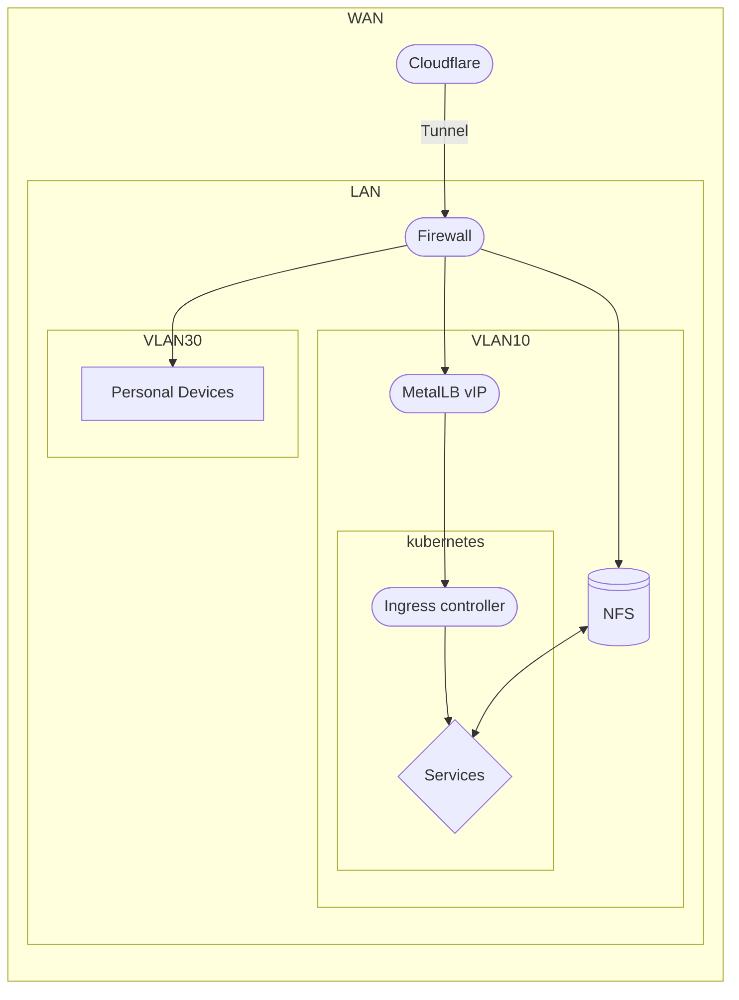
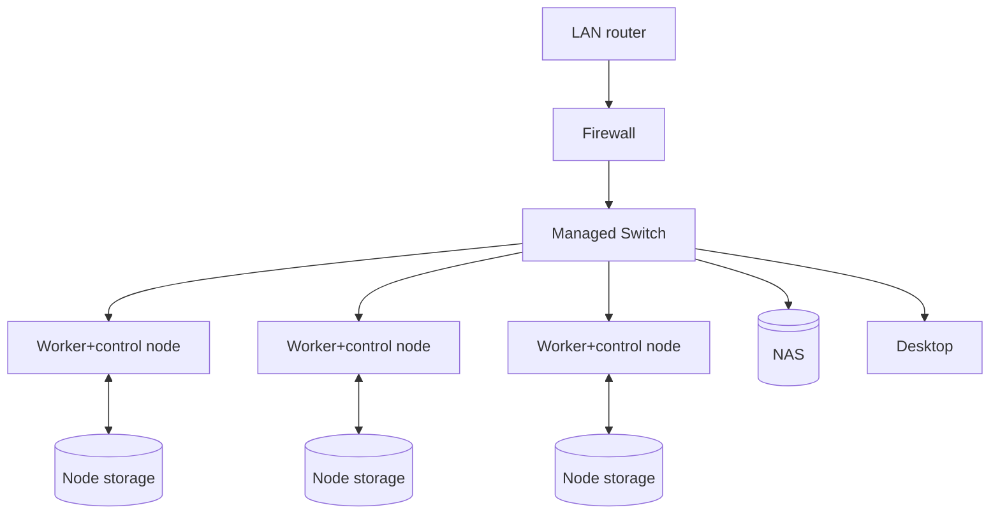

# Homelab (to-be)

## Software

### IaC

- [NoSpawnn/eepy_os](https://github.com/NoSpawnn/eepy_os) (customized Fedora CoreOS based OS)
- [Ignition](https://docs.fedoraproject.org/en-US/fedora-coreos/producing-ign/) (and [Butane](https://coreos.github.io/butane/)) for bootstrapping of hosts
- [Ansible](https://docs.ansible.com/ansible/latest/index.html) and [Podman Quadlets](https://docs.podman.io/en/latest/markdown/podman-quadlet.1.html) for deploying applications

### Other stuff

- [OPNsense](https://opnsense.org/) firewall
- [TrueNAS (Community Edition)](https://www.truenas.com/download-truenas-community-edition/)

## Hardware

## Architecture

### Network topology

<small>someone shout at me if this is stupid please</small>

### Hardware topology

## References/inspiration/docs/etc

- [What is the simplest way to apply an updated Ignition file? - Fedora Discussion](https://discussion.fedoraproject.org/t/what-is-the-simplest-way-to-apply-an-updated-ignition-file/112078/5)
- [barnabas/mediabarn](https://gitlab.com/barnix/mediabarn)
- [onedr0p/home-ops](https://github.com/onedr0p/home-ops)
- [Goodbye Synology: CHEAP DIY Modular NAS Build - FUTC](https://www.youtube.com/watch?v=Kzy_J82LQ-A)
- [Using *HA* Kubernetes at home, was never so simple! - Christian Lempa](https://www.youtube.com/watch?v=UdjhFLV1yt8)
- [I built a tiny home lab - Raid Owl](https://www.youtube.com/watch?v=ehIN08MxzMM)

## Future plans/ideas

- Boot nodes with iPXE to FCOS
    - [netboot.xyz](https://netboot.xyz/)
    - Auto-ignition? https://docs.fedoraproject.org/en-US/fedora-coreos/live-booting/#_booting_via_ipxe
- Could be worth looking into [talos](https://github.com/siderolabs/talos)
